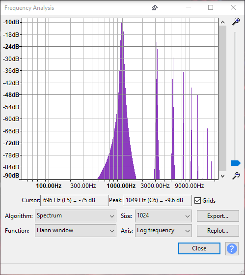

# synth_rewrite branch

This branch contains changes to improve the synth module of libtrackerboy.
The original synthesizer simply emulates the gameboy sound hardware and uses
nearest neighbor sampling to generate samples. This approach works, but
results in "naive" square waves. This causes the output to have ringing
artifacts at high frequencies as well as aliasing (see the images below).
Band-limited synthesis should be used instead in order to prevent these
effects.

The following figures show the frequency spectrum for a 50% duty square wave
at frequency 1049 Hz (C6). The figure on the left contains the spectrum for
the current synthesizer output. The figure on the right contains the spectrum
of a no-alias square wave generated by audacity at the same frequency. We want
our synthesizer's spectrum to match the goal spectrum.

Original                              | Goal
:------------------------------------:|:-------------------------------------:
 | 

## Changes to be made:
 * Osc class: wavefore oscillator, generates a waveform at a given gameboy
   frequency. PulseOsc, WaveOsc subclasses for pulse channels and wave channel,
   respectively.
 * Mixer rewrite. The mixer will work with a buffer of samples instead of
   mixing each sample individually. Two buffers are needed for this approach,
   a buffer for a channel and a final output buffer. For each channel, samples
   will be generated into the channel buffer, mixed and then added into the
   output buffer. The output buffer can then be filtered after adding the last
   channel buffer.
 * Channel rewrite. PulseChannel and WaveChannel will be rewritten to use the
   new Osc classes instead of using emulation. NoiseChannel will be rewritten
   to generate a buffer of samples.

The goal of this rewrite is to provide higher quality sound output with
minimal performance requirements. Once the rewrite is complete and greatly
improves the original in both performance and quality, this branch will be
merged with the develop branch.

## References

* Band-limited square waves - https://www.nayuki.io/page/band-limited-square-waves
* Band-limited synthesis - http://www.slack.net/~ant/bl-synth/
* Sinc sampling - https://www.desmos.com/calculator/8k5m6csfhf

# TrackerBoy

[![build-lib][build-lib-badge]][build-lib-link]
[![build-ui][build-ui-badge]][build-ui-link]
[![tests][tests-badge]][tests-link]

TrackerBoy is a tracker program for producing music for the gameboy / gameboy color
consoles.

WIP! This project is currently in the development phase (major version 0).

## Getting Started

 * __Build:__ To compile TrackerBoy from source, see the [build instructions](BUILD.md)
 * __Contribute:__ For contributing to this repo, see the [contributing guidelines](CONTRIBUTING.md) and [source code organization](ORGANIZATION.md)
 * __Use:__ For details on how to use the tracker, see TBD

## Versioning

This project uses Semantic Versioning v2.0.0

## Authors

 * stoneface ([@stoneface86](https://github.com/stoneface86)) - Owner

# License

This project is licensed under the MIT License - See [LICENSE](LICENSE) for more details

[build-lib-badge]: https://github.com/stoneface86/trackerboy/workflows/build-lib/badge.svg
[build-lib-link]: https://github.com/stoneface86/trackerboy/actions?query=workflow%3Abuild-lib
[build-ui-badge]: https://github.com/stoneface86/trackerboy/workflows/build-ui/badge.svg
[build-ui-link]: https://github.com/stoneface86/trackerboy/actions?query=workflow%3Abuild-ui
[tests-badge]: https://github.com/stoneface86/trackerboy/workflows/tests/badge.svg
[tests-link]: https://github.com/stoneface86/trackerboy/actions?query=workflow%3Atests
